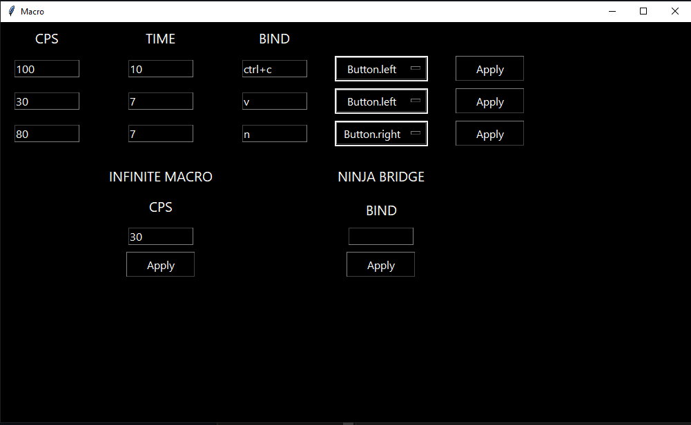

## Python app to make macro on your mouse

#### Desktop app which helps you to set practically infinite no. CPS on your mouse without any mouse software

  

A Few resources to get when you start write your first project in python:
- [Tkinter Desktop UI Library Documentation](https://docs.python.org/3/library/tk.html)
- [Python Documentation](https://docs.python.org/3/)

  

